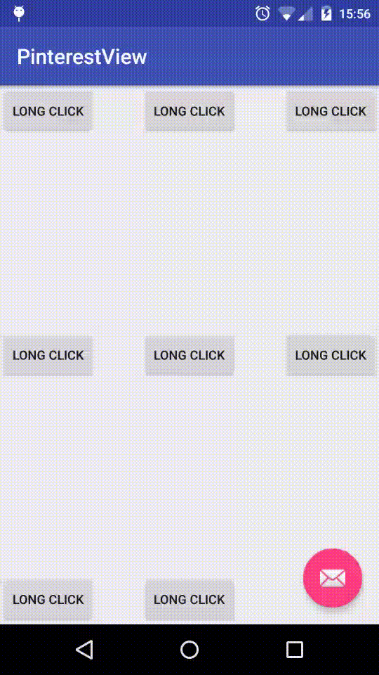

[](https://android-arsenal.com/details/1/2595)
# Pinterest like awesome menu control for Android

## DEMO


# NOTE
 Any pull request is available.
# HOW TO USE
```java

       /**
              * PinterestView'layoutParams must match_parent or fill_parent,
              * just for cover the whole screen
              */
             pinterestView = (PinterestView) findViewById(R.id.item_layout);
     
             /**
              * add item view into pinterestView
              */
             pinterestView.addMenuItem(createChildView(R.drawable.googleplus,"")
             , createChildView(R.drawable.linkedin,"linkedin"), createChildView(R.drawable.twitter,"twitter")
             , createChildView(R.drawable.pinterest,"pinterest"));
             /**
              * add pinterestview menu and Pre click view click
              */
             pinterestView.setPinClickListener(new PinterestView.PinMenuClickListener() {
     
                 @Override
                 public void onMenuItemClick(View view) {
                     Toast.makeText(MainActivity.this, view.getTag() + " clicked!", Toast.LENGTH_SHORT).show();
                 }
     
                 @Override
                 public void onAnchorViewClick() {
                     Toast.makeText(MainActivity.this, "button clicked!", Toast.LENGTH_SHORT).show();
                 }
             });

```

```xml

 <com.brucetoo.pinterestview.PinterestView
         xmlns:custom="http://schemas.android.com/apk/res-auto"
         android:id="@+id/item_layout"
         android:layout_width="match_parent"
         android:layout_height="match_parent"
         android:background="#50000000"
         custom:child_size="44dp"
         custom:child_radius="80dp"
         custom:child_max_scale="1.2"
         custom:tips_color="@android:color/white"
         custom:tips_size="15sp"
         custom:tips_background="@drawable/shape_child_item"
         android:visibility="gone"/>

```

## License

Copyright 2015 Bruce too

Licensed under the Apache License, Version 2.0 (the "License");
you may not use this file except in compliance with the License.
You may obtain a copy of the License at

    http://www.apache.org/licenses/LICENSE-2.0

Unless required by applicable law or agreed to in writing, software
distributed under the License is distributed on an "AS IS" BASIS,
WITHOUT WARRANTIES OR CONDITIONS OF ANY KIND, either express or implied.
See the License for the specific language governing permissions and
limitations under the License.

See [LICENSE](LICENSE) file for details.
